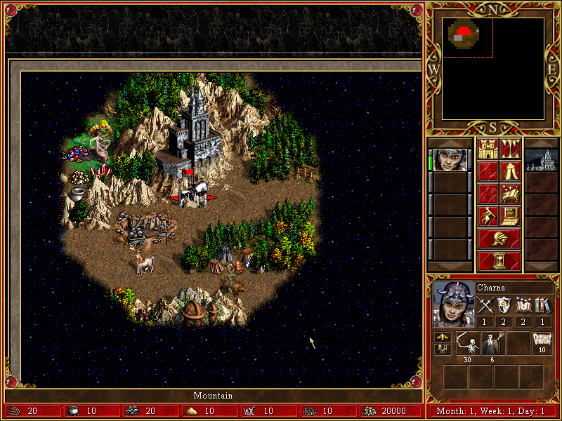
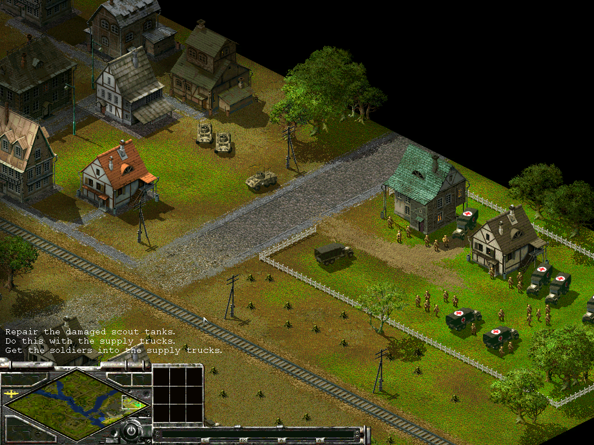

# SugarDraw

[](https://ko-fi.com/C0C619KV5Z)

SugarDraw is a DirectDraw graphics API emulation layer.
SugarDraw implements DirectDraw 2D graphics interfaces and provides 2D graphics capabilities for the systems where DirectDraw is not fully supported.

## Code
```
git clone --recurse-submodules https://github.com/EugeneKirian/SugarDraw
```

## Requirements & Dependencies
1. [Microsoft Visual Studio](https://visualstudio.microsoft.com/downloads/)

## Work in Progress

Examples of some games that can run with SugarDraw as the grahics API layer.




## Thanks

Thanks for the implementation tips & tricks to:
1. [CNC-Draw](https://github.com/FunkyFr3sh/cnc-ddraw)
2. [DDrawCompat](https://github.com/narzoul/DDrawCompat)
3. [DirectDraw Palette Emulator](https://github.com/ayuanx/pal-ddraw)

